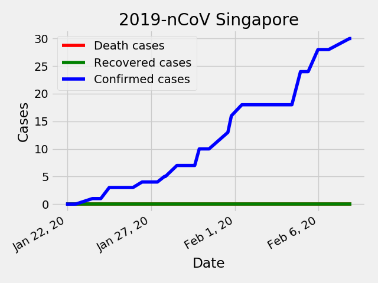
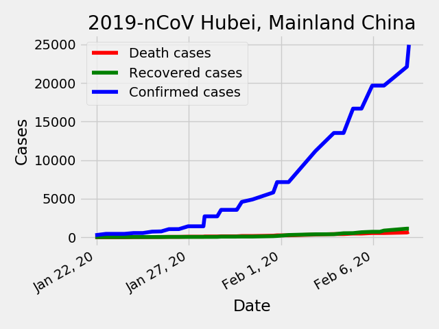
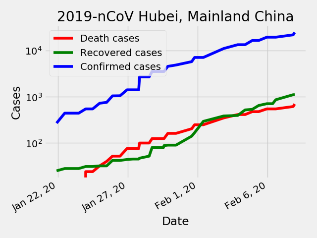

# 2019-nCov
> Using matplotlib to visualize data

## Examples

## Data source
- Johns Hopkins (Coronavirus 2019-nCoV Global Cases by Johns Hopkins CSSE): https://gisanddata.maps.arcgis.com/apps/opsdashboard/index.html#/bda7594740fd40299423467b48e9ecf6
- Google Spreadsheet: https://docs.google.com/spreadsheets/d/1UF2pSkFTURko2OvfHWWlFpDFAr1UxCBA4JLwlSP6KFo/edit#gid=0